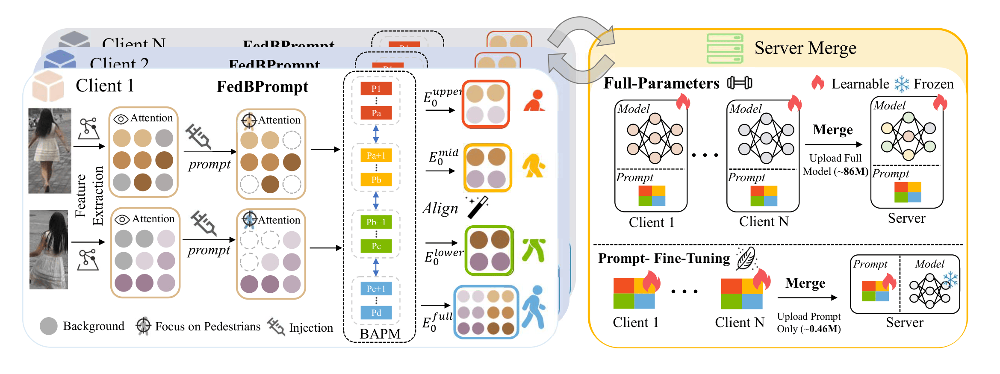

# FedBPrompt: Federated Domain Generalization Person Re-Identification via Body Distribution Aware Visual Prompts

[](link_to_your_paper)
[](https://opensource.org/licenses/MIT)

> Official PyTorch implementation of the CVPR 2026 paper **"FedBPrompt: Federated Domain Generalization Person Re-Identification via Body Distribution Aware Visual Prompts"**.

## 📖 Abstract

Federated Domain Generalization for Person Re-Identification (FedDG-ReID) aims to learn domain-invariant representations from decentralized data. Although Vision Transformers (ViTs) are widely adopted, their global attention often fails to distinguish pedestrians from high similarity backgrounds or diverse viewpoints—a challenge further amplified by cross-client distribution shifts. 

To address this, we propose **Federated Body Distribution Aware Visual Prompt (FedBPrompt)**, which introduces learnable visual prompts to explicitly guide Transformer attention toward pedestrian-centric regions. 

### ✨ Key Contributions
* **Body Distribution Aware Visual Prompts Mechanism (BAPM):** Divides prompts into *Holistic Full Body Prompts* to suppress cross-client background noise, and *Body Part Alignment Prompts* to capture fine-grained details robust to pose and viewpoint variations.
* **Prompt-based Fine-Tuning Strategy (PFTS):** Freezes the ViT backbone and updates only lightweight prompts, significantly reducing communication overhead (communicating ~0.46M parameters vs. the full 86M model) while maintaining adaptability.
* **Plug-and-Play:** Both BAPM and PFTS can be easily integrated into existing ViT-based FedDG-ReID frameworks.

## 🏗️ Framework



On each client, FedBPrompt injects learnable prompts to guide the model's attention toward pedestrian features. The core BAPM learns structured, part-level representations to solve feature misalignment. The framework supports both Full-Parameter training and efficient Prompt-Fine-Tuning (PFTS).

## 🚀 Main Results

Extensive experiments demonstrate that BAPM effectively enhances feature discrimination and cross-domain generalization[cite: 49]. 

**Comparison under Protocol-1 (Leave-One-Domain-Out):**
Tested across CUHK02 (C2), CUHK03 (C3), Market1501 (M), and MSMT17 (MS) datasets.

| Base Method            | MS+C2+C3→M      | MS+C2+M→C3      | C2+C3+M→MS          |
| ---------------------- | --------------- | --------------- | ------------------- |
| SSCU                   | 46.3 / 69.6     | 33.7 / 33.4     | 20.0 / 43.7         |
| **SSCU + PFTS (Ours)** | 48.9 / 72.4     | 35.5 / 35.8     | 21.3 / 46.0         |
| **SSCU + BAPM (Ours)** | **49.1 / 73.4** | **37.4 / 38.4** | **23.4** / **49.5** |

*For full experimental results and evaluations under Protocol-2 (Source-Domain Performance), please refer to our paper.*

## 🛠️ Getting Started

- CUDA>=11.7

- Download [ViT pre-trained model](https://github.com/rwightman/pytorch-image-models/releases/download/v0.1-vitjx/jx_vit_base_p16_224-80ecf9dd.pth) and put it under "./checkpoints"
- Data Preparation

```
BAPM/data    
│
└───market1501 OR msmt17
     │   
     └───Market-1501-v15.09.15 OR MSMT17_V1
         │   
         └───bounding_box_train
         │   
         └───bounding_box_test
         | 
         └───query
```
